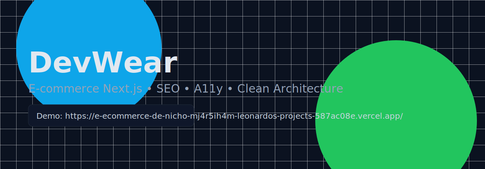

<div align="center">



<br />

<a href="https://e-ecommerce-de-nicho-mj4r5ih4m-leonardos-projects-587ac08e.vercel.app/" target="_blank">
	
</a>
<a href="https://e-ecommerce-de-nicho-mj4r5ih4m-leonardos-projects-587ac08e.vercel.app/" target="_blank">
	
</a>

</div>

# DevWear — E-commerce (Next.js 14)

DevWear é um e-commerce de nicho para vestuário e acessórios dev. Foco em SEO, acessibilidade (A11y), performance e arquitetura limpa, com páginas de produto componentizadas.

➡️ Link do executável (preview): https://e-ecommerce-de-nicho-mj4r5ih4m-leonardos-projects-587ac08e.vercel.app/

Principais pilares:

- SEO forte (meta + JSON-LD de Organization, SiteNavigationElement e Product)
- Acessibilidade: rotas, formulários com aria-live, foco visível, skip link
- Renderização híbrida (SSG/ISR + CSR onde faz sentido)
- Arquitetura limpa: separação de orquestração e componentes puros, Context + hooks

## Como rodar

Pré-requisitos: Node 18+ e npm.

```powershell
npm install
npm run dev
```

Aplicação em http://localhost:3000

Build de produção:

```powershell
npm run build
npm start
```

Variáveis de ambiente (SEO / URLs absolutas):

```
NEXT_PUBLIC_SITE_URL=https://seu-dominio.com
```

Coloque em `.env.local`.

## Features

- Header responsivo com JSON-LD de Organization + SiteNavigationElement
- Página de produto com galeria, informações, ações, avaliações e relacionados (SSG/ISR)
- Carrinho componentizado com resumo, frete e cupom (UI acessível com aria-live)
- Cálculo de parcelamento via utilitário `computeInstallment`
- Botões e temas padronizados; badge de economia para pagamento via Pix
- Páginas de login e signup com SEO e acessibilidade
- Testes com Vitest + React Testing Library (cálculos e A11y do carrinho)

## Tecnologias

- Next.js 14 (Pages Router)
- TypeScript
- Tailwind CSS
- Context API + useReducer
- Vitest, @testing-library/react, jsdom, jest-dom

## Performance & Observabilidade

Ferramentas e abordagens adotadas para garantir carregamento rápido e evitar regressões:

- Bundle Analyzer opcional (`ANALYZE=1 npm run build`) via `@next/bundle-analyzer` – OCP: extensão sem modificar config base.
- Script de verificação de orçamento de performance: `npm run perf:budget` (SRP: um único propósito – analisar tamanhos). Ajustável via variáveis de ambiente.
- `npm run typecheck` (feedback rápido CI sem emitir artefatos) – Clean Code: falha cedo.
- Imports dinâmicos para seções não críticas (ex: listas de produtos, banners) diminuem JS inicial e melhoram LCP.
- Browserslist moderna reduz polyfills (ISP: dependemos de interface menor de runtime).

Orçamento inicial (scripts/perfBudget.mjs):

- First Load JS: 130 kB
- Page chunk: 80 kB

Relatórios falham o CI caso o limite seja excedido (DIP: limites via env em vez de alterar código).

## Estrutura e arquitetura

- `src/pages` — páginas com SSG/ISR e rotas
- `src/components` — UI modular (produto, cart, layout)
- `src/context/CartContext.tsx` — estado global do carrinho (persistido em localStorage)
- `src/hooks/useCart.ts` — derivação de totais, savings e parcelamento
- `src/utils/payments.ts` — `computeInstallment(total, { maxInstallments, minPerInstallment })`
- `src/utils/format.ts` — formatação de moeda

## Rotas principais

- `/` Home (SSG)
- `/products` Lista de produtos (SSG + ISR, filtros client-side)
- `/products/[slug]` Produto (SSG + getStaticPaths + JSON-LD Product)
- `/cart` Carrinho (CSR, acessível com aria-live)
- `/login` e `/signup` (SEO + A11y)

## API (endpoints)

Por padrão o projeto é front-end; inclui um endpoint de health-check como exemplo. Você pode expandir para carrinho/checkout conforme necessário.

### GET /api/health

- Descrição: Verifica a saúde do serviço.
- Exemplo de requisição:

```http
GET /api/health HTTP/1.1
Host: localhost:3000
```

- Resposta:

```json
{
  "ok": true
}
```

### POST /api/shipping (exemplo sugerido)

Não implementado; sugerido para futura integração com gateway de frete.

- Body (JSON):

```json
{
  "zip": "01001-000",
  "items": [{ "sku": "tee-001", "qty": 2, "weight": 0.3 }]
}
```

- Resposta (200):

```json
{
  "service": "PAC",
  "price": 19.9,
  "etaBusinessDays": "5-9"
}
```

### POST /api/coupon (exemplo sugerido)

Não implementado; sugerido para aplicar regras de preço e retornar descontos.

- Body (JSON):

```json
{ "code": "DEV10" }
```

- Resposta (200):

```json
{
  "valid": true,
  "discountType": "percent",
  "amount": 10
}
```

## Testes

```powershell
npm run test
```

Cobertura atual:

- `payments.test.ts` — valida `computeInstallment`
- `orderSummary.aria.test.tsx` — checa ARIA e badge de economia no `OrderSummary`

## Deploy

Hospedado preferencialmente na Vercel. Configure o projeto apontando o repositório e defina `NEXT_PUBLIC_SITE_URL` no ambiente de produção.

- Preview: https://e-ecommerce-de-nicho-mj4r5ih4m-leonardos-projects-587ac08e.vercel.app/

## Licença

Uso educacional/portfólio.
